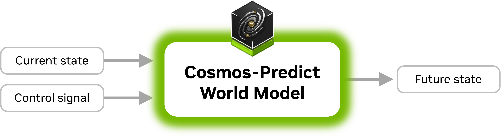
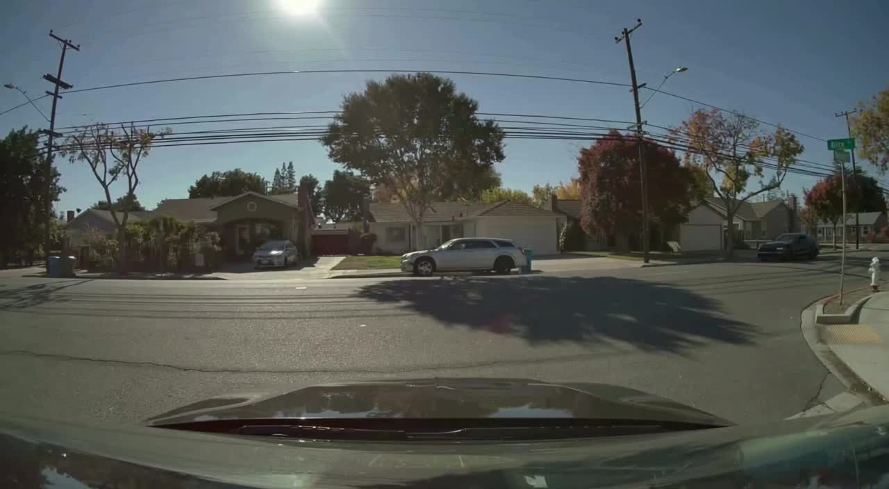

<p align="center">
    
</p>

### Paper (coming soon!) | [Website](https://research.nvidia.com/labs/dir/cosmos-predict2/) | [Hugging Face](https://huggingface.co/collections/nvidia/cosmos-predict2-68028efc052239369a0f2959)

Cosmos-Predict2 is a key branch of the [Cosmos World Foundation Models](https://www.nvidia.com/en-us/ai/cosmos) (WFMs) ecosystem for Physical AI, specializing in future state prediction through advanced world modeling. It offers two powerful capabilities: text-to-image generation for creating high-quality images from text descriptions, and video-to-world generation for producing visual simulations from video inputs.

We visualize the architecture of Cosmos-Predict2 in the following figure.

<p align="center">
    
</p>

## Models

* [Cosmos-Predict2-2B-Text2Image](https://huggingface.co/nvidia/Cosmos-Predict2-2B-Text2Image): Text-to-image generation
* [Cosmos-Predict2-14B-Text2Image](https://huggingface.co/nvidia/Cosmos-Predict2-14B-Text2Image): Text-to-image generation
* [Cosmos-Predict2-2B-Video2World](https://huggingface.co/nvidia/Cosmos-Predict2-2B-Video2World): Video + Text based future visual world generation
* [Cosmos-Predict2-14B-Video2World](https://huggingface.co/nvidia/Cosmos-Predict2-14B-Video2World): Video + Text based future visual world generation
---

## Quick Start

Here is a quick example demonstrating how to use Cosmos-Predict2-2B-Video2World for video generation:

```python
import torch
from imaginaire.utils.io import save_image_or_video
from cosmos_predict2.configs.base.config_video2world import PREDICT2_VIDEO2WORLD_PIPELINE_2B
from cosmos_predict2.pipelines.video2world import Video2WorldPipeline

# Create the video generation pipeline.
pipe = Video2WorldPipeline.from_config(
    config=PREDICT2_VIDEO2WORLD_PIPELINE_2B,
    dit_path="checkpoints/nvidia/Cosmos-Predict2-2B-Video2World/model-720p-16fps.pt",
    text_encoder_path="checkpoints/google-t5/t5-11b",
)

# Specify the input image path and text prompt.
image_path = "assets/video2world/example_input.jpg"
prompt = "A wide-angle shot captures a sunny suburban street intersection, where the bright sunlight casts sharp shadows across the road. The scene is framed by a row of houses with beige and brown roofs, and lush green lawns. Autumn-colored trees add vibrant red and orange hues to the landscape. Overhead power lines stretch across the sky, and a fire hydrant is visible on the right side of the frame near the curb. A silver sedan is parked on the driveway of a house on the left, while a silver SUV is parked on the street in front of the house at the center of the camera view. The ego vehicle waits to turn right at the t-intersection, yielding to two other vehicles traveling in opposite directions. A black car enters the frame from the right, driving across the intersection and continuing straight ahead. The car's movement is smooth and steady, and it exits the frame to the left. The final frame shows the intersection with a vehicle moving from the left to the right side, the silver sedan and the SUV still parked in their initial positions, and the black car having moved out of view."

# Run the video generation pipeline.
video = pipe(input_path=image_path, prompt=prompt)

# Save the resulting output video.
save_image_or_video(video, "output/test.mp4", fps=16)
```

**Input prompt:**
> A wide-angle shot captures a sunny suburban street intersection, where the bright sunlight casts sharp shadows across the road. The scene is framed by a row of houses with beige and brown roofs, and lush green lawns. Autumn-colored trees add vibrant red and orange hues to the landscape. Overhead power lines stretch across the sky, and a fire hydrant is visible on the right side of the frame near the curb. A silver sedan is parked on the driveway of a house on the left, while a silver SUV is parked on the street in front of the house at the center of the camera view. The ego vehicle waits to turn right at the t-intersection, yielding to two other vehicles traveling in opposite directions. A black car enters the frame from the right, driving across the intersection and continuing straight ahead. The car's movement is smooth and steady, and it exits the frame to the left. The final frame shows the intersection with a vehicle moving from the left to the right side, the silver sedan and the SUV still parked in their initial positions, and the black car having moved out of view.

| Input image | Output video |
|-------------|--------------|
|  | <video width="512" src="https://github.com/user-attachments/assets/4ea7d13b-36cc-4803-81e4-2cc65fdf24f7"></video> |

---

## User Guide
Our [setup guide](documentations/setup.md) provides complete information on
* [System requirements](documentations/setup.md#system-requirements): Detailed hardware and software prerequisites
* [Installation](documentations/setup.md#installation): Step-by-step setup with both Conda and Docker options
* [Downloading checkpoints](documentations/setup.md#downloading-checkpoints): Instructions for obtaining model weights
* [Troubleshooting](documentations/setup.md#troubleshooting): Solutions for common installation and CUDA compatibility issues

For inference examples and usage
* **[Text2Image Inference](documentations/inference_text2image.md)**: Guide for generating high-quality images from text prompts
* **[Video2World Inference](documentations/inference_video2world.md)**: Guide for generating videos from images/videos with text prompts, including:
  * Single and batch processing
  * Multi-frame conditioning
  * Multi-GPU inference for faster generation
  * Using the prompt refiner
  * Rejection sampling for quality improvement
* **[Text2World Inference](documentations/inference_text2world.md)**: Guide for generating videos directly from text prompts, including:
  * Single and batch processing
  * Multi-GPU inference for faster generation

For post-training customization
* **[Post-training guide](documentations/post-training_video2world.md)**: General guide to the training system in the codebase
* **[Post-training on Cosmos-NeMo-Assets](documentations/post-training_video2world_cosmos_nemo_assets.md)**: Case study for post-training on Cosmos-NeMo-Assets data

Our [performance guide](documentations/performance.md) includes
* [Hardware requirements](documentations/performance.md#hardware-requirements): Recommended GPU configurations and memory requirements
* [Performance benchmarks](documentations/performance.md#performance-benchmarks): Detailed speed and quality comparisons across different GPU architectures
* [Model selection guide](documentations/performance.md#model-selection-guide): Practical advice for choosing between 2B and 14B variants based on your needs

---

## Contributing

We thrive on community collaboration! [NVIDIA-Cosmos](https://github.com/nvidia-cosmos/) wouldn't be where it is without contributions from developers like you. Check out our [Contributing Guide](CONTRIBUTING.md) to get started, and share your feedback through issues.

Big thanks 🙏 to everyone helping us push the boundaries of open-source physical AI!

---

## License and Contact

This project will download and install additional third-party open source software projects. Review the license terms of these open source projects before use.

This model includes safety and content moderation features powered by Llama Guard 3. Llama Guard 3 is used solely as a content input filter and is subject to its own license.

NVIDIA Cosmos source code is released under the [Apache 2 License](https://www.apache.org/licenses/LICENSE-2.0).

NVIDIA Cosmos models are released under the [NVIDIA Open Model License](https://www.nvidia.com/en-us/agreements/enterprise-software/nvidia-open-model-license). For a custom license, please contact [cosmos-license@nvidia.com](mailto:cosmos-license@nvidia.com).
