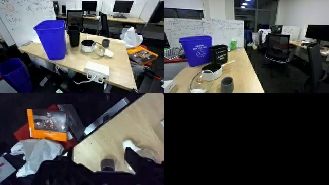

# Video2World Post-training for DreamGen Bench

This guide provides instructions on running post-training with Cosmos-Predict2 Video2World models.

## Table of Contents
- [Prerequisites](#prerequisites)
- [Preparing Data](#1-preparing-data)
- [Post-training](#2-post-training)
- [Inference with the Post-trained checkpoint](#3-inference-for-gr00t-dreams-checkpoints)
- [Inference for DreamGen Benchmark](#4-inference-for-dreamgen-benchmark)

## Prerequisites

Before running training:

1. **Environment setup**: 
  - Follow the [Setup guide](setup.md) for installation instructions.
  - For user who want to run the command in https://github.com/nvidia/GR00T-dreams, after setup the environment, run the following command to install extra dependencies:
  ```bash
  # If use Docker and see ERROR: Cannot install httpcore==1.0.7 because these package versions have conflicting dependencies
  # The following command may help resolve the package version conflict:
  # grep -v "^h11==" /etc/pip/constraint.txt > /etc/pip/constraint_new.txt && mv /etc/pip/constraint_new.txt /etc/pip/constraint.txt
  # grep -v "^httpcore==" /etc/pip/constraint.txt > /etc/pip/constraint_new.txt && mv /etc/pip/constraint_new.txt /etc/pip/constraint.txt
  pip install openai tyro numpydantic albumentations tianshou git+https://github.com/facebookresearch/pytorch3d.git
  ```
2. **Model checkpoints**: Download required model weights following the [Downloading Checkpoints](setup.md#downloading-checkpoints) section in the Setup guide.
3. **Hardware considerations**: Review the [Performance guide](performance.md) for GPU requirements and model selection recommendations.


Example of the training data for the GR1 and DROID models:

| Dataset | Text prompt | Training video |
|-------------|--------------|--------------|
| GR1 | Use the left hand to pick up red milk carton from teal bowl to pink plate. |<video width="512" src="https://github.com/user-attachments/assets/2e204518-1d1c-448a-b8c5-b7d6b64b0b3d"></video> |
| DROID | A multi-view video shows that a robot put the marker on the table The video is split into four views: The top-left view shows the robotic arm from the left side, the top-right view shows it from the right side, the bottom-left view shows a first-person perspective from the robot's end-effector (gripper), and the bottom-right view is a black screen (inactive view). The robot put the marker on the table | <video width="512" src="https://github.com/user-attachments/assets/c9d612f2-e69a-44f2-8935-2c47c9395a49"></video> |

## 1. Preparing Data
### 1.1 Download DreamGen Bench Training Dataset
For training on the robotic training datasets from the DreamGen paper, please use the following command to download the GR1 training dataset from https://huggingface.co/datasets/nvidia/GR1-100

under `cosmos-predict2/` folder, run:
```
# This command will download the videos for physical AI

huggingface-cli download nvidia/GR1-100 --repo-type dataset --local-dir datasets/benchmark_train/hf_gr1/ && \
mkdir -p datasets/benchmark_train/gr1/videos && \
mv datasets/benchmark_train/hf_gr1/gr1/*mp4 datasets/benchmark_train/gr1/videos && \
mv datasets/benchmark_train/hf_gr1/metadata.csv datasets/benchmark_train/gr1/
```

### 1.2 Preprocessing the Data
Run the following command to pre-compute T5-XXL embeddings for the video captions used for post-training:

```bash
# The script will use the provided prompt, save the T5-XXL embeddings in pickle format.
python -m scripts.get_t5_embeddings_from_groot_dataset --dataset_path datasets/benchmark_train/gr1
```

Dataset folder format:
```
datasets/benchmark_train/gr1/
├── metas/
│   ├── *.txt
├── videos/
│   ├── *.mp4
├── t5_xxl/
│   ├── *.pickle
```

## 2. Post-training
#### Cosmos-Predict2-2B-Video2World

Run the following command to execute an example post-training job with `GR1` data.
```bash
EXP=predict2_video2world_training_2b_groot_gr1_480
torchrun --nproc_per_node=8 --master_port=12341 -m scripts.train --config=cosmos_predict2/configs/base/config.py -- experiment=${EXP}
```

The model will be post-trained using the `GR1` dataset.
See the config `predict2_video2world_training_2b_groot_gr1_480` defined in `cosmos_predict2/configs/base/experiment/groot.py` to understand how the dataloader is defined.
```python
# GROOT example
example_video_dataset_gr1 = L(Dataset)(
    dataset_dir="datasets/benchmark_train/gr1",
    num_frames=93,
    video_size=(432, 768),
)

dataloader_train_gr1 = L(DataLoader)(
    dataset=example_video_dataset_gr1,
    sampler=L(get_sampler)(dataset=example_video_dataset_gr1),
    batch_size=1,
    drop_last=True,
    num_workers=8,
    pin_memory=True,
)
```

The checkpoints will be saved to `checkpoints/PROJECT/GROUP/NAME`.
In the above example, `PROJECT` is `posttraining`, `GROUP` is `video2world`, `NAME` is `2b_groot_gr1_480`.

See the job config to understand how they are determined.
```python
predict2_video2world_training_2b_groot_gr1_480 = dict(
    dict(
        ...
        job=dict(
            project="posttraining",
            group="video2world",
            name="2b_groot_gr1_480",
        ),
        ...
    )
)
```

The checkpoints will be saved in the below structure.
```
checkpoints/posttraining/video2world/2b_groot_gr1_480/checkpoints/
├── model/
│   ├── iter_{NUMBER}.pt
├── optim/
├── scheduler/
├── trainer/
├── latest_checkpoint.txt
```

##### Cosmos-Predict2-14B-Video2World

Run the following command to execute an example post-training job with `GR1` data with 4 nodes with 8 GPUs.
```bash
EXP=predict2_video2world_training_14b_groot_gr1_480
NVTE_FUSED_ATTN=0 torchrun --nproc_per_node=8 --nnodes=4 --rdzv_id 123 --rdzv_backend c10d --rdzv_endpoint $MASTER_ADDR:1234 \
-m scripts.train --config=cosmos_predict2/configs/base/config.py -- experiment=${EXP}
```
* Optionally, you could load the `Cosmos-Predict2-14B-Video2World-GR00T-Dreams-GR1` checkpoint for initialization, by appending `model.config.model_manager_config.dit_path=checkpoints/nvidia/Cosmos-Predict2-14B-Video2World-Sample-GR00T-Dreams-GR1/model-480p-16fps.pt` to the above command.

## 3. Inference for GR00T Dreams Checkpoints
checkout [inference_video2world.md](inference_video2world.md) for more examples of how to use the inference script.

* Inference with GR1 checkpoint
```bash
torchrun --nproc_per_node=8 --master_port=12341 \
  -m examples.video2world_gr00t \
  --model_size 14B \
  --gr00t_variant gr1 \
  --prompt "Use the right hand to pick up rubik\'s cube from from the bottom of the three-tiered wooden shelf to to the top of the three-tiered wooden shelf." \
  --input_path assets/sample_gr00t_dreams_gr1/8_Use_the_right_hand_to_pick_up_rubik\'s_cube_from_from_the_bottom_of_the_three-tiered_wooden_shelf_to_to_the_top_of_the_three-tiered_wooden_shelf..png \
  --num_gpus 8 \
  --prompt_prefix "" \
  --save_path output/generated_video_gr1.mp4 \
```

* Inference with DROID checkpoint
```bash
torchrun --nproc_per_node=8 --master_port=12341 \
  -m examples.video2world_gr00t \
  --model_size 14B \
  --gr00t_variant droid \
  --prompt "A multi-view video shows that a robot pick the lid and put it on the pot The video is split into four views: The top-left view shows the robotic arm from the left side, the top-right view shows it from the right side, the bottom-left view shows a first-person perspective from the robot's end-effector (gripper), and the bottom-right view is a black screen (inactive view). The robot pick the lid and put it on the pot" \
  --input_path assets/sample_gr00t_dreams_droid/episode_000408.png \
  --prompt_prefix "" \
  --num_gpus 8 \
  --save_path output/generated_video_droid.mp4
```

Example of the inference output:

| Checkpoint | Text prompt | Input Image | Training video |
|-------------|--------------|--------------|--------------|
| GR1 | Use the right hand to pick up rubik's cube from from the bottom of the three-tiered wooden shelf to to the top of the three-tiered wooden shelf. |  |  <video width="512" src="https://github.com/user-attachments/assets/b5faec63-8954-46dd-9251-7ff1c0de389a"></video> |
| DROID | A multi-view video shows that a robot pick the lid and put it on the pot The video is split into four views: The top-left view shows the robotic arm from the left side, the top-right view shows it from the right side, the bottom-left view shows a first-person perspective from the robot's end-effector (gripper), and the bottom-right view is a black screen (inactive view). The robot pick the lid and put it on the pot |  | <video width="512" src="https://github.com/user-attachments/assets/129399bc-7c35-4549-9f28-7823543b5db9"></video> |

## 4. Inference for DreamGen Benchmark
### 4.1 Download the DreamGen Benchmark dataset
* The following command will download the DreamGen Benchmark dataset from https://huggingface.co/datasets/nvidia/EVAL-175
```
huggingface-cli download nvidia/EVAL-175 --repo-type dataset --local-dir dream_gen_benchmark
```

### 4.2 Prepare batch input json
```bash
python -m scripts.prepare_batch_input_json \
  --dataset_path dream_gen_benchmark/gr1_object/ \
  --save_path results/dream_gen_benchmark/cosmos_predict2_14b_gr1_object/ \
  --output_path dream_gen_benchmark/gr1_object/batch_input.json
```

### 4.3 Inference
```bash
python -m examples.video2world_gr00t \
  --model_size 14B \
  --gr00t_variant gr1 \
  --batch_input_json dream_gen_benchmark/gr1_object/batch_input.json \
  --disable_guardrail
```
* Note: For full evaluation without missing videos, it's better to turn off the guardrail checks (add `--disable_guardrail` to the command) to make sure all the videos are generated.
* See [documentations/inference_video2world.md](documentations/inference_video2world.md) for inference run details.